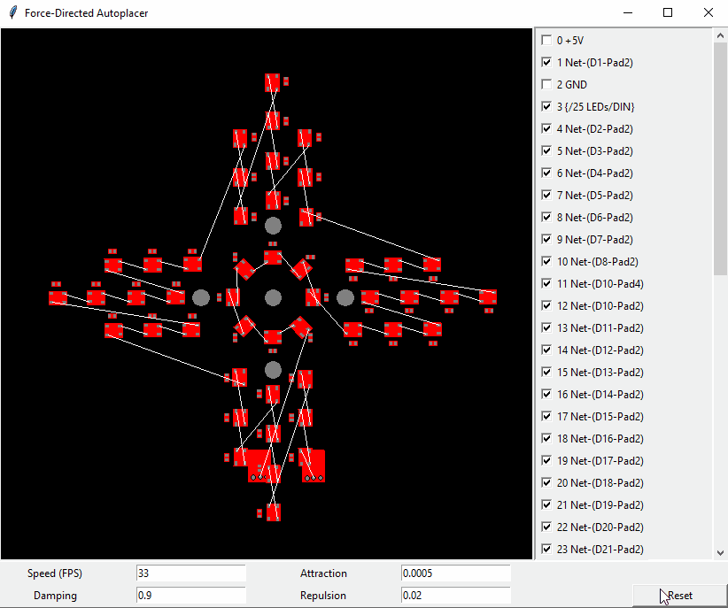

# Force Directed Autoplacer

Physics-defined circuit board layout.

## The Theory

From Wikipedia:

> Force-directed graph drawing algorithms are a class of algorithms for drawing graphs in an aesthetically-pleasing way. Their purpose is to position the nodes of a graph in two-dimensional or three-dimensional space so that all the edges are of more or less equal length and there are as few crossing edges as possible, by assigning forces among the set of edges and the set of nodes, based on their relative positions, and then using these forces either to simulate the motion of the edges and nodes or to minimize their energy.

Oh my. That sounds like what my brain is doing while I'm laying out a circuit board.

## Why?

The idea has been bouncing around in my head for a few months. I also have a thing for making perfectly valid, competent PCBs that make other engineers uncomfortable in ways they can't articulate or defend.

## Usage

- Run `python main.py` to start an example PCB
- Deselect nets as desired. Usually power and ground nets are too dense to be useful
- Play around with attractor and repulsor forces
- To load in a different PCB, edit line 14 of `pcbparse.py`
- Change the zoom of the main window in line 17 of `main.py`. Pan is not implemented.

## Future Work

- Clean up the hacks that require editing the code for each project: Better file input, automatic zoom and pan
- Respect the board outline layer, so components can bounce around inside it
- Turn this into a KiCad module so that it can be launched from within
- Exporting footprint positions back into a PCB file. Can rewrite the PCB file, but this is also straightforward using the KiCad API
- Fix the many edge cases that break the project
- Make a PCB with zero footprints that have right angles
- Come up with more fun examples and animations - Please submit them in Issues!

## Likelihood of Most of That Actually Happening

Low. This repo can be seen as an experiment that has served its purpose.

